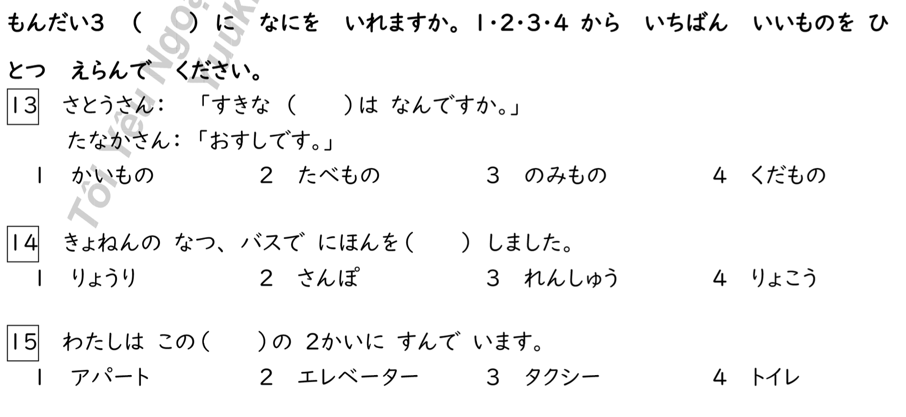

## Test sections and test times


## Composition of test items


## Card types

  - [select reading](#select-reading)
  - [select kanji](#select-kanji)
  - [fill blank](#fill-blank)
  - [resembling sentence](#resembling-sentence)
  - [order words in sentence](#order-words-in-sentence)
  - [best use for word](#best-use-for-word)
  - [learn kanji](#learn-kanji)
  - [learn vocabulary](#learn-vocabulary)
  - [learn kana](#learn-kana)

### select reading


<p style="color:red;">Used in JLPT test</p>

Select correct hiragana reading for the underlined kanji word. Can be composed of multiple or single kanji.
4 answer optionsa available. Options resemble each other and can be gibberish.

Contents of the card:
```javascript
{
  id: 12,
  sentence: 'らいげつ　国へ　かえります。',
  furigana: '6:くに',
  ulStartIndex: 6,
  ulEndIndex: 6,
  audio_man: '9328440932.mp3',
  audio_woman: '870439580.mp3',
  translation: 'based on language id',
  answerOptions: [
    {
      option: 'くに',
      correct: true
    },
    {
      option: 'こく',
      correct: false
    },
        {
      option: 'ぐに',
      correct: false
    },
        {
      option: 'ごく',
      correct: false
    }
  ]
}
```

### select kanji


<p style="color:red;">Used in JLPT test</p>

Select correct hiragana reading for the underlined hiragana word. Can be composed of multiple or single hiragana.
4 answer optionsa available. Options resemble each other and can be gibberish.

Contents of the card:
```javascript
{
  id: 12,
  sentence: 'ここで　でんしゃに　のります',
  furigana: '',
  audio_man: '9328440932.mp3',
  audio_woman: '870439580.mp3',
  translation: 'based on language id',
  answerOptions: [
    {
      option: '電東',
      correct: false
    },
    {
      option: '雷東',
      correct: false
    },
        {
      option: '電車',
      correct: true
    },
        {
      option: '雷車',
      correct: false
    }
  ]
}
```

### fill blank



<p style="color:red;">Used in JLPT test</p>

Fill in the blank area with correct word. Can be composed of multiple or single kanji/hiragana.
4 answer optionsa available. Options resemble each other and can be gibberish.
Question can be "conversational".

Contents of the card:
```javascript
{
  id: 12,
  sentenceBlank: 'きょねんの　なつ、バスで　にほんを（　　　）しました。',
  sentence: 'きょねんの　なつ、バスで　にほんを　りょこうしました。',
  furigana: '',
  audio_man: '9328440932.mp3',
  audio_woman: '870439580.mp3',
  translation: 'based on language id',
  answerOptions: [
    {
      option: 'りょうり',
      correct: false
    },
    {
      option: 'さんぽ',
      correct: false
    },
        {
      option: 'れんしゅう',
      correct: false
    },
        {
      option: 'りょこう',
      correct: true
    }
  ]
}
```

### resembling sentence


<p style="color:red;">Used in JLPT test</p>

Select the sentence that has closest same meaning as the question sentence.
4 answer optionsa available. Options resemble each other.

Contents of the card:
```javascript
{
  id: 12,
  sentence: 'これは りょうしんの しゃしんです。',
  furigana: '',
  audio_man: '9328440932.mp3',
  audio_woman: '870439580.mp3',
  translation: 'based on language id',
  answerOptions: [
    {
      option: 'これは あねと いもうとの しゃしんです。',
      correct: false,
      furigana: '',
      translation: 'based on language id'
    },
    {
      option: 'これは あにと おとうとの しゃしんです。',
      correct: false,
      furigana: '',
      translation: 'based on language id'
    },
    {
      option: 'これは ちちと ははの しゃしんです',
      correct: true,
      furigana: '',
      translation: 'based on language id'
    },
        {
      option: 'これは そふと そぼの しゃしんです',
      correct: false,
      furigana: '',
      translation: 'based on language id'
    }
  ]
}
```

### order words in sentence


<p style="color:red;">Used in JLPT test</p>

Order the four words given into the sentence and give the correct number for the word that goes to stars place.
4 answer optionsa available. All are part of the question sentence.

Contents of the card:
```javascript
{
  id: 12,
  sentenceBlank: 'この ___ _⭑_ ___ ___ とき　べんりです。',
  sentence: 'このかばんは　かるくて　じょうぶだから　りょこうのとき　べんりです',
  furigana: '',
  audio_man: '9328440932.mp3',
  audio_woman: '870439580.mp3',
  translation: 'based on language id',
  answerOptions: [
    {
      option: 'りょこうの',
      correct: false
    },
    {
      option: 'じょうぶだから',
      correct: false

    },
    {
      option: 'かばんは',
      correct: false
    },
        {
      option: 'かるくて',
      correct: true
    }
  ]
}
```

### best use for word


<p style="color:red;">Used in JLPT test</p>

Given a word, select the most suitable sentence for the word.
4 answer optionsa available. Options resemble each other and can be gibberish.

Contents of the card:
```javascript
{
  id: 12,
  word: 'せまい',
  furigana: '',
  audio_man: '9328440932.mp3',
  audio_woman: '870439580.mp3',
  translation: 'based on language id',
  answerOptions: [
    {
      option: 'この みちは せまいので 、車は とおれません。',
      correct: true
    },
    {
      option: 'このズボンは わたしには 少しせまいです。',
      correct: false

    },
    {
      option: '小さいじ を 書く ときは 、 せまい ペンが いいです。',
      correct: false
    },
        {
      option: 'その やさいは せまく きって ください',
      correct: false
    }
  ]
}
```

### learn kanji

Kanji cards can have two different review types, recall and recognize.
These are for 2 different purpose of learning.

Contents of the card:
```javascript
{
  id: 12,
  reviewType: ReviewType.RECOGNISE,
  kanji: '車',
  keyword: 'car', // based on language id
  story: 'looks like a vehicle from birds eye view', // based on language id
  hint: 'pictograph', // based on language id
  onyomi: 'しゃ',
  kunyomi: 'くるま',
  onyomiRomaji: 'sha',
  kunyomiRomaji: 'kuruma',
  answerOptions: [
    {
      option: 'car', // based on language id
      correct: true
    },
    {
      option: 'airplane', // based on language id
      correct: false
    },
    {
      option: 'boat', // based on language id
      correct: false
    },
    {
      option: 'bicycle', // based on language id
      correct: false
    }
  ]
}
```

### learn vocabulary

Vocabulary cards can have three different review types, recall, recognize and writeout.
These are for 2 different purpose of learning.

Contents of the card:
```javascript
{
  id: 12,
  cardType: CardType.VOCABULARY,
  reviewType: ReviewType.RECALL,
  word: '自転車',
  keyword: 'bicycle', // based on language id
  reading: 'じてんしゃ',
  readingRomaji: 'jitensha',
  audio_man: '9328440932.mp3',
  audio_woman: '870439580.mp3',
  answerOptions: [
    {
      option: '自転車',
      correct: true
    },
    {
      option: '自動車',
      correct: false
    },
    {
      option: '自動販売機',
      correct: false
    },
    {
      option: '自分',
      correct: false
    }
  ]
}
```

### learn kana

Kana cards can have two different review types, recall and recognize.
These are for 2 different purpose of learning.

Contents of the card:
```javascript
{
  id: 12,
  cardType: CardType.KATAKANA,
  reviewType: ReviewType.RECOGNISE,
  kana: 'ホ',
  keyword: 'ho',
  story: 'Looks like the HOly cross with sunlight shining behind it', // based on language id
  hint: 'jesus christ', // based on language id
  answerOptions: [
    {
      option: 'ho',
      correct: true
    },
    {
      option: 'ko',
      correct: false
    },
    {
      option: 'so',
      correct: false
    },
    {
      option: 'no',
      correct: false
    }
  ]
}
```


Learn grammar


Teaching card

Introduces new grammar points etc.


review types

recall,
recognise,
writeout
none